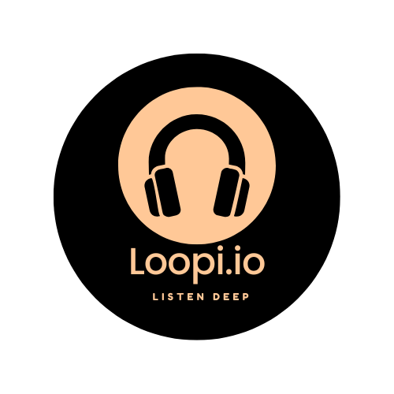

<p align="center">
  
</p>

# 🎧 Loopi.io - API Node.js do Player de Música

Loopi.io é uma aplicação moderna que começou como um player de música desktop em **Python + PyQt6** e agora evolui para uma arquitetura web escalável com **Node.js + Express**, usando **padrão MVC** para garantir manutenibilidade, performance e profissionalismo.

> ⚠️ Projeto em desenvolvimento ativo. Pode conter funcionalidades parciais e ajustes em andamento.

---

## 🚀 Tecnologias Utilizadas

- **Node.js**
- **Express.js**
- **JavaScript (ES6+)**
- **Arquitetura MVC (Model-View-Controller)**
- **Insomnia/Postman** para testes de rotas

---

## 📁 Estrutura de Pastas

```
Loopi.io/
├── controllers/
│   └── pingController.js
├── routes/
│   └── pingRoutes.js
├── services/
├── models/
├── config/
├── app.js
├── server.js
└── package.json
```

---

## 📌 Rotas Atuais

| Método | Rota            | Descrição          |
|--------|------------------|--------------------|
| GET    | `/api/ping`      | Teste de conexão   |

---

## 🛠️ Como Rodar o Projeto

### 1. Clone o repositório:
```bash
git clone https://github.com/seu-usuario/loopi.io.git
cd loopi.io
```

### 2. Instale as dependências:
```bash
npm install
```

### 3. Inicie o servidor:
```bash
npm run dev
```

O servidor ficará disponível em `http://localhost:3000`.

---

## 🔍 Testando a API

Use uma ferramenta como o **Postman** ou **Insomnia** e envie uma requisição GET para:

```
http://localhost:3000/api/ping
```

**Resposta esperada:**
```json
{ "message": "pong" }
```

---

## 📈 Próximas Funcionalidades

- [ ] CRUD de playlists
- [ ] Upload de músicas via API
- [ ] Integração com base de dados
- [ ] Autenticação e perfis de usuário
- [ ] Dashboard de consumo
- [ ] Deploy em ambiente cloud

---

## 📄 Licença

Este projeto está sob a licença MIT. Livre para modificar e evoluir.

---

## 🧠 Visão do Projeto

> Transformar o player Loopi.io em uma **plataforma de streaming** com foco em UX premium, backend escalável e integração multiplataforma (web, desktop, mobile).